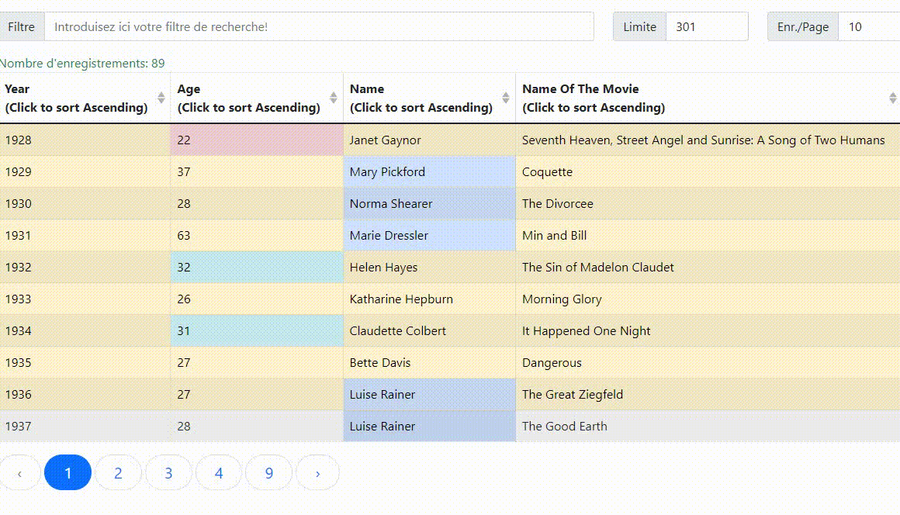

# htmllookup
Fast html/javascript lookup generated from a csv file

The API is still unstable!



Example (without error checks):
```golang
package main

import (
	"github.com/msilvoso/htmllookup"
)

func main() {
	h, _ := htmllookup.NewFromFile("testdata/oscar_age_female.csv", ',')
	h.Title = "Oscar winning ladies"
	h.Hover()
	h.Bordered()
	h.Striped()
	h.AddOption("year", htmllookup.OCellIsGreaterOrEqual, 1980, true, "success")
	h.AddOption("age", htmllookup.OCellIsLowerOrEqual, 23, false, "danger")
	h.AddOption("age", htmllookup.OCellIsGreaterOrEqual, 30, false, "info")
	h.AddOption("index", htmllookup.OCellIsLower, 10, true, "warning")
	h.AddOption("name", htmllookup.OCellIsGreater, "lll", false, "primary")
	h.HideColumns("index")
	h.SearchableColumns("year", "name", 4)
	h.Process()
	h.Save("oscar.html")
}
```

```golang
const (
    OCellHasValue         = 1
    OCellIsEqual          = 2
    OCellIsGreater        = 4
    OCellIsLower          = 8
    OCellIsGreaterOrEqual = 16
    OCellIsLowerOrEqual   = 32
)
```

## Functions

### func [New](/htmllookup.go#L43)

`func New() *htmlLookup`

New is the simple factory for the htmlLookup struct
you will still need to load some data

### func [NewFromData](/htmllookup.go#L50)

`func NewFromData(content [][]string) (*htmlLookup, error)`

NewFromData instantiates a new struct preloading it with the content of a slice

### func [NewFromFile](/htmllookup.go#L61)

`func NewFromFile(fileName string, delimiter rune) (*htmlLookup, error)`

NewFromFile instantiates a new struct preloading it with the content of a csv file


